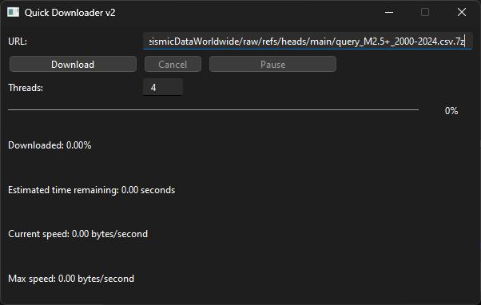

# Quick Downloader

A command line-based GUI tool for downloading large files quickly and efficiently.

## About

The Quick Downloader is a Python-based tool that uses multi-threading to download large files quickly and efficiently. It splits the download into multiple parts and downloads them concurrently, significantly reducing the total download time.

The tool utilizes Python's threading capabilities and the `requests` library for handling HTTP requests. It also provides a simple and intuitive command line interface for easy use.

## Features

* Multi-threaded downloading for fast and efficient downloads
* Supports HTTP and HTTPS downloads
* Supports large file downloads (> 2GB)
* Supports resumable downloads (if server supports it)
* Supports custom number of threads for download
* Supports custom download speed limit
* Supports logging of download progress and errors
* Supports pause and resume of downloads
* Supports cancellation of downloads

## Screenshots

Test downloading [this file](https://github.com/nadeeshafdo/SeismicDataWorldwide/raw/refs/heads/main/query_M2.5+_2000-2024.csv.7z).

## Usage

1. Install the requirements using `pip install -r requirements.txt`.
2. Run the script using `python main.py`.
3. Enter the URL of the file you want to download and the path to save it to.
4. Optionally, you can specify the number of threads to use and the download speed limit.
5. Click the "Download" button to start the download.
6. You can pause and resume the download at any time.
7. You can cancel the download at any time.
